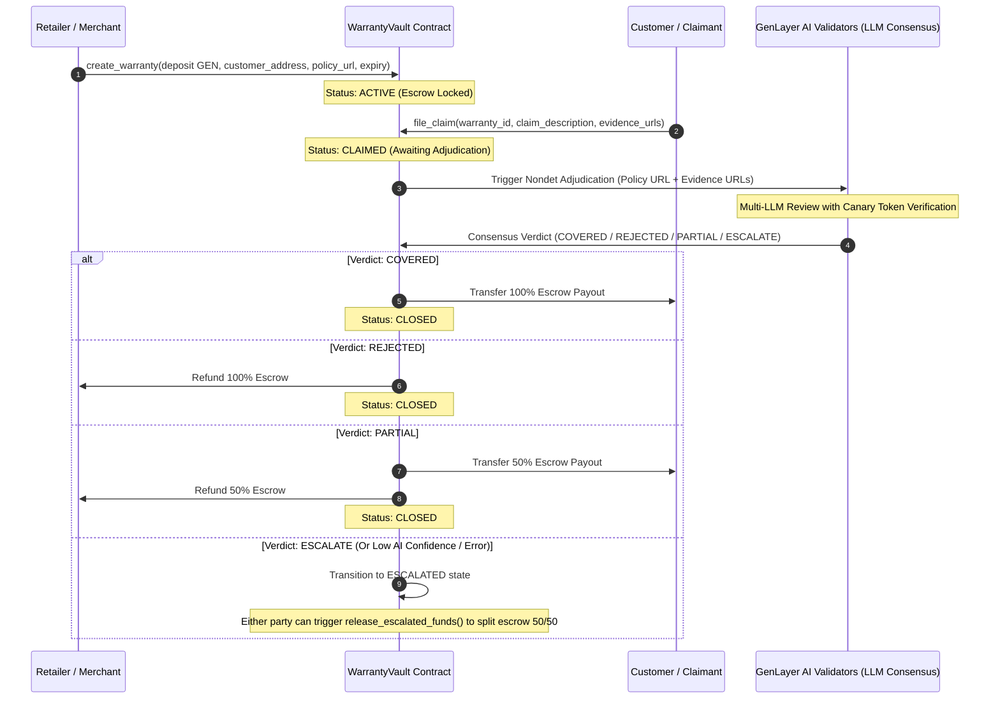

# 🛡️ WarrantyVault: AI-Powered Decentralized Escrow & Adjudication Protocol

WarrantyVault is an Intelligent Contract protocol built on **GenLayer** that revolutionizes hardware warranty management. It secures customer claims and merchant escrows on-chain, utilizing decentralized AI validators (LLMs) to adjudicate disputes based on natural language warranty policies and claim evidence.

---

## 🎯 The Core Problem

1. **Corporate Bias**: Traditional warranty claims are reviewed by the merchants themselves, leading to conflicts of interest and unfair rejections.
2. **High Friction**: Claim resolution takes weeks, requiring manual paperwork and shipping before verification.
3. **Lack of Automation**: There is no trustless way to lock up warranty funds in escrow and automatically disburse them upon valid hardware failures.

---

## 💡 The GenLayer Solution

WarrantyVault implements a synthetic judicial system for consumer protection:
* **Trustless Escrow**: The merchant locks up warranty claim funds (in GEN) on-chain during creation.
* **AI Consensus Adjudication**: When a claim is filed, a decentralized jury of GenLayer AI validators reads the official policy, analyzes the customer's natural-language claim and web-hosted evidence (e.g. proof-of-damage images or logs), and reaches consensus on a verdict.
* **Instant On-Chain Settlements**: Payouts are executed automatically upon AI consensus, eliminating intermediaries.

---

## 🏗️ Protocol Architecture & Flow



---

## 🔒 Security Hardening (Milestone 1 Improvements)

We have upgraded the protocol with enterprise-grade blockchain AI security features:
1. **Prompt Injection Canary Defense**: All user-controlled parameters (`product_info`, `claim_description`, `evidence_urls`) are enclosed inside strict XML-like boundary tags in the LLM prompt. A deterministic, transaction-derived SHA-256 canary token is generated. The AI must return this token in its JSON response. Any mismatch triggers an immediate consensus veto and scales the state to `ESCALATE` to prevent prompt injection attacks from draining the escrow.
2. **Trusted Runtime Timestamp Parser**: Bypasses sandbox limitations (no standard library datetime imports allowed) with a manual, zero-dependency ISO-8601 parser. It extracts the trusted timestamp from `gl.message_raw['datetime']` to enforce strict warranty expiry validation.
3. **Address Normalization**: Input validation ensures that customer addresses conform to hex address specifications to prevent runtime VM crashes.
4. **Exceptions Standard**: Replaced generic exceptions with `UserError` to supply clear revert logs to the dApp frontend.

---

## 🛠️ Tech Stack & Structure

* **Smart Contract**: Python (GenVM Intelligent Contract framework)
* **Frontend**: React (Vite, TypeScript, Tailwind CSS, Framer Motion)
* **Web3 Library**: `genlayer-js`
* **Test Suite**: `gltest` (pytest for GenVM)

```
├── contracts/
│   └── warranty_vault.py        # Intelligent Contract
├── src/
│   ├── App.tsx                  # React Frontend dApp
│   └── main.tsx
├── scripts/
│   ├── e2e_onchain_test.js      # On-chain Integration Test Script
│   └── verify_contract.py       # AST Structure Verification Checks
├── tests/
│   └── test_warranty_vault.py   # Unit Test Suite
└── README.md
```

---

## 🚀 How to Run Locally

### 1. Prerequisite: Node.js & Python 3
Ensure you have Node.js (v18+) and Python (v3.10+) installed.

### 2. Install Dependencies
```bash
# Install frontend packages
npm install
```

### 3. Run Unit Tests
```bash
python -m unittest tests/test_warranty_vault.py
```

### 4. Run AST Validation
```bash
python scripts/verify_contract.py
```

### 5. Run Live On-Chain Expired Warranty Rejection Audit
```bash
node scripts/test_expired_warranty_onchain.js
```

### 6. Launch the Frontend
```bash
npm run dev
```

---

## 🧪 On-Chain Verification & Security Proofs

We have verified on-chain on GenLayer Studionet that expired warranties are strictly rejected with `UserError("Warranty has expired")` and that fail-closed semantics prevent expired claims from passing:

* **Target Contract**: [`0xe2b3459193Aaa6B616ceA6C5903b5978D7BDbd5B`](https://explorer-studio.genlayer.com/address/0xe2b3459193Aaa6B616ceA6C5903b5978D7BDbd5B)
* **Creation Tx (Short 10s Expiry)**: [`0xb18a35d1d6ab51e37f4ea4fa88aba16be195f39a3d6821eed95d11ab20e020ca`](https://explorer-studio.genlayer.com/tx/0xb18a35d1d6ab51e37f4ea4fa88aba16be195f39a3d6821eed95d11ab20e020ca)
* **Expired Claim Revert Tx (Proven On-Chain Rejection)**: [`0x65f06b18565a9d695be6f8fb6a018593ce755a2aacf76372cc9debb3df1e0d80`](https://explorer-studio.genlayer.com/tx/0x65f06b18565a9d695be6f8fb6a018593ce755a2aacf76372cc9debb3df1e0d80)
  * Revert Reason: `UserError: Warranty has expired`
  * Execution Outcome: `ERROR` / `contract_error`
  * State Integrity: Storage remains `ACTIVE`, no expired claim accepted.

---

## 🌐 Deployed Network Config (GenLayer Studionet)

* **Target Network**: GenLayer Studionet
* **Contract Address**: `0xe2b3459193Aaa6B616ceA6C5903b5978D7BDbd5B`
* **Explorer URL**: [GenLayer Studio Explorer](https://explorer-studio.genlayer.com/address/0xe2b3459193Aaa6B616ceA6C5903b5978D7BDbd5B)
* **Live dApp URL**: [https://warranty-vault-genlayer.vercel.app](https://warranty-vault-genlayer.vercel.app)
